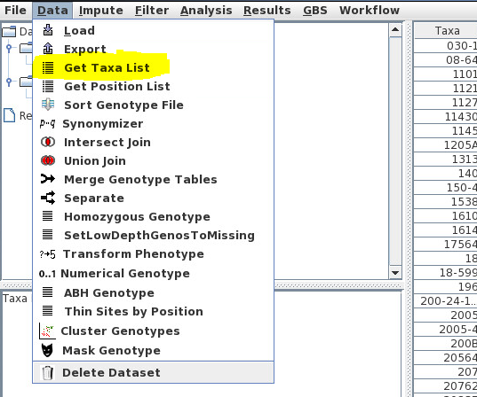

# SNPversity #

Web-based tool to visualize single nucleotide polymorphisms (SNP) diversity.
Can be accessed [here](http://www.maizegdb.org/snpversity).

## Overview ##


| Name             | Corresponding File(s) |
|------------------|:---------------------:|
| Stocks Extractor | [TaxaExtractor.php](./TaxaExtractor.php)|
| Stocks File | [Input Example](./tassel/input/Q8d5213d29ef4d615629cdb54ea1076fb.taxainfo)|
| TASSEL Wrapper | [Tassel_gt_server.java](./tassel/tassel-wrapper/src/tassel_gt_server/Tassel_gt_server.java)|
| JSON SNP Data | [Output Example](./tassel/output/1_O8d5213d29ef4d615629cdb54ea1076fb.json)|
| Diversity Data | This should be added to the [Tassel](./tassel) directory. |
| Homepage | [home.php](./home.php) |
| Visualization of Results | [send.php](./send.php)|
| Query scheduler | [service.php](service.php)|


#### [time_estimate/](/time_estimate)
This folder contains the [python script](/time_estimate/fetch_time.py) used to predict query execution time. It accepts dataset, # stocks, range of positions (in bp) as an input, and returns the estimated time in seconds. For example, in order to get estimated query processing time for AllZeaGBSv2.7 dataset with 100 stocks across 18121 bp's:

```
$ python2.7 fetch_time.py AllZeaGBSv27public20140528 100 128121
```

#### [tassel/](/tassel)
The [Tassel](http://www.maizegenetics.net/tassel) part of the project used for processing queries lives here. The Tassel wrapper source code is contained in file [Tassel_gt_server.java](/tassel/tassel-wrapper/src/tassel_gt_server/Tassel_gt_server.java). In production, the only necessary file to include is:

* [tassel-gt-server-david-SPLIT.jar](tassel/tassel-gt-server-david-SPLIT.jar) is the exported JAR file which gets called by the server-side PHP scripts.


## HDF5 Datasets
 * Currently, 4 diversity data sets are supported by SNPversity. These should be dropped in the [tassel](./tassel) directory according to the **"File name in SNPversity"** column. The files are:

| Dataset Name| Assembly| # Stocks (Taxa)| # SNP's | File size (GB)| File name in SNPversity|
|-------------|---------|----------------|---------|---------------|------------------------|
|[ZeaGBSv27publicImputed20150114](http://cbsusrv04.tc.cornell.edu/users/panzea/download.aspx?filegroupid=4)|B73_Refgen_V2|17280|955,690|5.1|ZeaGBSv27publicImputed20150114.h5|
|[AllZeaGBSv27public20140528](http://cbsusrv04.tc.cornell.edu/users/panzea/download.aspx?filegroupid=4)|B73_Refgen_V2|18013|955,690|11.6|AllZeaGBSv27public20140528.h5|
|[ZeaHM321_LinkImpute](http://cbsusrv04.tc.cornell.edu/users/panzea/download.aspx?filegroupid=15)|B73_Refgen_V3|1210|83,153,144|34.2|ZeaHM321_LinkImpute.h5|
|[ZeaHM321_raw](http://cbsusrv04.tc.cornell.edu/users/panzea/download.aspx?filegroupid=15)|B73_Refgen_V3|1210|83,153,144|24.7|ZeaHM321_raw.h5|


## Environment Requirements ##

#### Java Version 1.8.0_77
* The Tassel files (version 5.2.17) are included in the repository for your convenience. All other required libraries need to be added.
* For a list of these libraries and where to put them, consult [manifest.txt](/tassel/tassel-wrapper/manifest.txt) for the time being.

#### PHP Version 5.3.3
* No additional libraries required.

#### Python Version 2.7.6
* See [requirements.txt](requirements.txt).

#### Database (PostgreSQL) Version 8.4.20
* The pg_dumpall flat file containing all the tables can be retrieved from [MaizeGDB's FTP server](http://ftp.maizegdb.org/MaizeGDB/FTP/SNPversity/).
* Alternatively, see the [schema-only flat file](http://ftp.maizegdb.org/MaizeGDB/FTP/SNPversity/).
* Database connections are established using the [db_controller.php](db_controller.php). Change the connection details according to your setup.

#### Apache Web Server Version 2.2.15
* No additional customization needed.

## Installation / Setting up ##
1. Install & configure all technologies mentioned in Environment Requirements.
2. Drop HDF5 files in [tassel](./tassel) directory.
3. After setting up PostgreSQL, import the tables from the database dump flat file that you chose.
4. Change [db_controller.php](db_controller.php) to satisfy your DB configuration.
5. Modify absolute paths used in code to match your environment.


## Adding new dataset(s) ##
If you wish to add your dataset to SNPversity, please contact us [here](https://maizegdb.org/contact).

There are 4 main steps for adding a new dataset:
1. Downloading the dataset.
2. Creating a PostgreSQL Table for the stocks of the dataset.
3. Creating a PostgreSQL Table containining the gene models and their associated positions.
4. Updating the code.

### Downloading the dataset ###
1. Download a HDF5 file into [tassel](./tassel) directory. See [Panzea Datasets](https://www.panzea.org/genotypes)
2. Use the TASSEL software to extract a list of stocks/taxa into a "TaxaList" JSON file. To do this:
    1. Load the HDF5 file into TASSEL
    2. Click on "Data" --> "Get Taxa List"
    
    
    
    3. Click on "Data" --> "Export"
    
### Creating a PostgreSQL Table for the stocks of the dataset ###
1. Create a PostgreSQL Table to store the list of stocks. These are going to populate a list later in the [home.php](./home.php). For an example, see the `hapmapv3` table in the [schema-only flat file](http://ftp.maizegdb.org/MaizeGDB/FTP/SNPversity/).
2. Create a script to parse the "TaxaList" JSON file and populate the table. One such example script is located in the `/root/Desktop/HapMapV3Taxa` directory of the VM.
3. Create a PHP script that waits for requests to fetch data from the table. For an example, see [get_taxa_hapmapv3.php](./get_taxa_hapmapv3.php)

### Creating a PostgreSQL Table containining the gene models and their associated positions ###
1. Create a PostgreSQL Table for the gene model positions. This is later going to be used by [home.php](./home.php) and [send.php](./send.php). For an example see the `b73v3ranges` table in the [schema-only flat file](http://ftp.maizegdb.org/MaizeGDB/FTP/SNPversity/).
2. Create a script that populates the table of gene model positions. See [V3AnnotatorRanges.py](./annotation/V3AnnotatorRanges.py) and [V3IntronCorrector.py](./annotation/V3IntronCorrector.py) for an example. **This is by far the most time-consuming and error-prone step.**

### Updating the code ###
| File             | Affected Code Regions |
|------------------|:---------------------:|
| [home.php](./home.php) | HTML for new dataset |
| [home.js](./js/home.js) | onChromosomeChange(),onDataSetChange(),onAssemblyChange()  |
| [get_gene_models.php](./get_gene_models.php) | All functions |
| [send.php](./send.php) | Updating branch logic for new assembly |
| [TaxaExtractor.php](./TaxaExtractor.php) | extract() |
| [get_table_body.php](./get_table_body.php) | generateGbrowseURL($row_result, $gbrowser_version) |
| [fetch_time.py](./time_estimate/fetch_time.py) | Add support for new models once enough data has been collected by [service.php](./service.php) |

## Optimization ##
In order to reduce query processing times, modify the `writeToJSON()` function in [Tassel_gt_server.java](./tassel/tassel-wrapper/src/tassel_gt_server/Tassel_gt_server.java)
